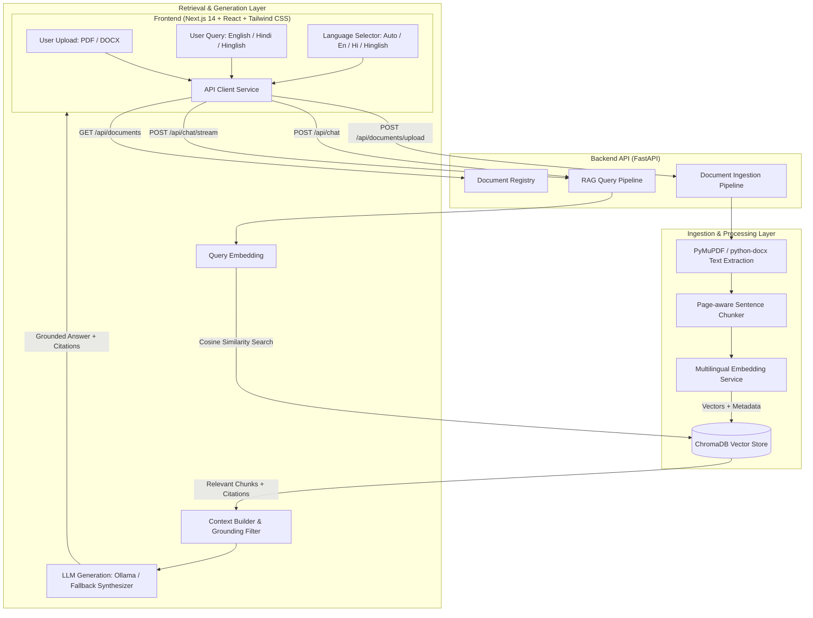

# DOC-Lingo
### Multilingual & Cross-Lingual Document Intelligence using RAG

DOC-Lingo is a production-grade multilingual Retrieval-Augmented Generation (RAG) platform that empowers users to upload PDF and DOCX documents and interact with them in multiple languages—specifically **English**, **Hindi (हिन्दी)**, and **Hinglish (Roman script Hindi)**.

The core differentiator of DOC-Lingo is **genuine semantic cross-lingual retrieval**:
- An English technical textbook or operating systems PDF can be indexed in its original language.
- A user can ask a query in Hindi (*"डेडलॉक क्या होता है?"*) or colloquial Hinglish (*"Deadlock kya hota hai aur processes wait kyun karte hain?"*).
- Using multilingual vector representations (`paraphrase-multilingual-MiniLM-L12-v2` / `BAAI/bge-m3`), the system projects the query and English document chunks into a shared semantic vector space, retrieves the exact relevant passages without pre-translating the corpus, and grounds an accurate answer with verifiable page citations.

---

## Architecture Overview



---

## Key Features

- **Cross-Lingual Semantic Retrieval**: Queries in Hindi or Hinglish retrieve relevant English document chunks based on semantic meaning rather than simple keyword matches or crude full-document translations.
- **Page-Aware Chunking & Exact Citations**: Maintains page numbers for PDFs, chunk indices, and filename metadata. Citations link back to actual retrieved chunks—never fabricated.
- **Dual Format Ingestion**: High-performance extraction for both `.pdf` (via PyMuPDF) and `.docx` (via python-docx) with filename sanitization and file size limits.
- **Language Mode Selection**:
  - **Auto**: Automatically infers the query language (English, Devanagari Hindi, or Roman-script Hinglish) and matches the response.
  - **English / Hindi / Hinglish**: Forces target output language while preserving critical technical terminology (e.g. *Deadlock, Mutual Exclusion, Semaphore*).
- **Isolated Architecture**: Vector database access is decoupled behind abstract interfaces (`BaseVectorStore`), allowing ChromaDB to be swapped for Qdrant, Milvus, or pgvector. Embeddings (`BaseEmbeddingService`) and LLMs (`BaseLLMService`) are similarly isolated behind factory patterns.
- **Local Development with Ollama**: Fully supports local open-source LLMs (`llama3.2`, `mistral`, `gemma`) via Ollama, with graceful fallback to a grounded synthesizer when offline.

---

## Tech Stack

- **Frontend**: Next.js 14 (App Router), React 18, TypeScript, Tailwind CSS, Lucide Icons.
- **Backend**: Python 3.10+, FastAPI, Pydantic v2, Pydantic-Settings, Uvicorn.
- **Document Processing**: PyMuPDF (`fitz`), `python-docx`.
- **Vector Database**: ChromaDB (isolated behind `ChromaVectorStore`).
- **Embeddings**: `sentence-transformers/paraphrase-multilingual-MiniLM-L12-v2` (configurable to `BAAI/bge-m3`).
- **LLM Support**: Ollama (default `llama3.2`), extensible to OpenAI / Gemini.

---

## Project Structure

```
DOC-Lingo/
├── backend/
│   ├── app/
│   │   ├── api/
│   │   │   └── endpoints.py         # REST & SSE streaming endpoints
│   │   ├── core/
│   │   │   └── config.py            # Centralized RAG & server config
│   │   ├── schemas/
│   │   │   ├── document.py          # Document & chunk Pydantic models
│   │   │   └── chat.py              # Chat request, response & citation models
│   │   ├── services/
│   │   │   ├── ingestion/           # PDF/DOCX extractors and page chunkers
│   │   │   ├── embeddings/          # Multilingual vector embedding service
│   │   │   ├── retrieval/           # ChromaDB vector store abstraction
│   │   │   ├── generation/          # LLM prompt construction & Ollama service
│   │   │   ├── language/            # Hindi/Hinglish/English script detector
│   │   │   └── rag_service.py       # Main end-to-end RAG orchestrator
│   │   └── main.py                  # FastAPI application entrypoint
│   ├── tests/
│   │   ├── fixtures/                # Bilingual test PDFs and DOCX files
│   │   ├── test_components.py       # Unit tests for chunker, sanitizer & detector
│   │   ├── test_rag_pipeline.py     # 6 cross-lingual RAG test scenarios
│   │   └── test_api_endpoints.py    # FastAPI endpoint test client
│   └── requirements.txt
├── frontend/
│   ├── app/
│   │   ├── globals.css              # Modern Tailwind theme & typography
│   │   ├── layout.tsx               # Root layout
│   │   └── page.tsx                 # Main application view
│   ├── components/
│   │   ├── ChatArea.tsx             # Interactive conversation UI
│   │   ├── Sidebar.tsx              # Document upload & knowledge base manager
│   │   ├── CitationsList.tsx        # Expandable chunk citations with score
│   │   └── LanguageSelector.tsx     # Auto/En/Hi/Hinglish language picker
│   ├── lib/
│   │   ├── api.ts                   # Dedicated frontend API service client
│   │   └── utils.ts
│   ├── types/                       # TypeScript models
│   ├── package.json
│   └── tsconfig.json
├── .env.example
├── .gitignore
└── README.md
```

---

## Installation & Setup

### Prerequisites
- Node.js 18+ & npm
- Python 3.10+ (tested on Python 3.13)
- (Optional) [Ollama](https://ollama.ai) with `llama3.2` installed:
  ```bash
  ollama run llama3.2
  ```

### 1. Backend Setup

```bash
# Navigate to repository root
cd DOC-Lingo

# Create and activate Python virtual environment
python3 -m venv backend/venv
source backend/venv/bin/activate

# Install dependencies
pip install -r backend/requirements.txt

# Copy environment variables
cp .env.example .env
```

### 2. Frontend Setup

```bash
# Navigate to frontend directory
cd frontend

# Install Node dependencies
npm install
```

---

## Running Locally

### Start Backend API Server
```bash
# In repository root with venv activated:
source backend/venv/bin/activate
uvicorn backend.app.main:app --host 0.0.0.0 --port 8000 --reload
```
The interactive Swagger API documentation will be available at [http://localhost:8000/docs](http://localhost:8000/docs).

### Start Frontend Application
```bash
# In frontend directory:
cd frontend
npm run dev
```
Open [http://localhost:3000](http://localhost:3000) in your browser.

---

## Running Tests

DOC-Lingo includes automated test suites validating text extraction, chunking, metadata preservation, API contracts, and end-to-end cross-lingual retrieval.

```bash
# Activate virtual environment
source backend/venv/bin/activate

# Run full backend test suite
PYTHONPATH=. pytest backend/tests/ -v
```

### Verified Test Scenarios:
1. **English document → English question**: Validates standard grounded retrieval and citation verification.
2. **English document → Hindi (Devanagari) question**: Validates that `"डेडलॉक क्या होता है?"` retrieves relevant English deadlock passages.
3. **English document → Hinglish question**: Validates that `"Deadlock kya hota hai?"` retrieves English passages and answers in natural Hinglish.
4. **Hindi document → English question**: Validates cross-lingual retrieval in reverse (English question retrieves Hindi DBMS documentation).
5. **Multi-document retrieval**: Validates specific document routing when multiple documents are indexed.
6. **Out-of-domain rejection**: Validates that irrelevant queries (e.g. lasagna recipes) yield grounded "not found" responses without hallucinations.

---

## Future Roadmap

- [ ] Support for additional Indic languages (Tamil, Telugu, Bengali, Marathi, Gujarati).
- [ ] Hybrid Search (combining BM25 lexical search with dense vector embeddings).
- [ ] Cross-encoder reranking (e.g., `bge-reranker-large`) for precision top-K refinement.
- [ ] Multi-turn query rewriting for conversational context resolution.
- [ ] Built-in PDF canvas viewer with bounding box highlighting for cited chunks.
- [ ] OCR integration (Tesseract / PaddleOCR) for scanned PDFs.
